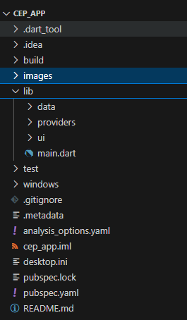
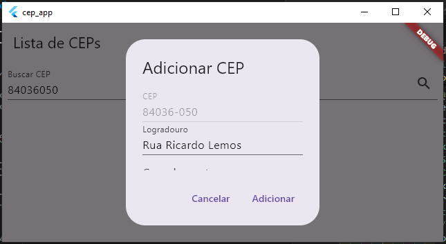
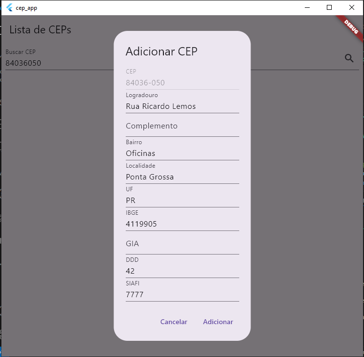

# 💻 Cadastro de CEPs (Flutter + Back4App + ViaCEP)

## 🎯 Objetivo

Este aplicativo Flutter foi desenvolvido para demonstrar a criação de uma aplicação desktop para Windows que permite aos usuários consultar, cadastrar, atualizar e excluir informações de CEPs (Códigos de Endereçamento Postal). O aplicativo utiliza:

***Back4App:** Como backend (plataforma *Backend as a Service*), para armazenar os dados dos CEPs de forma persistente.
***ViaCEP:** Como API externa para buscar informações de CEPs que ainda não estão cadastrados no Back4App.
***Provider:** Para gerenciamento de estado.
***http:** Para comunicação com as APIs REST (Back4App e ViaCEP).
***logger:** Para fins de debug

Ele oferece uma interface gráfica simples e intuitiva, com um campo de busca e uma lista para exibir os CEPs cadastrados.

## 🏗️ Estrutura do Aplicativo

O aplicativo segue uma arquitetura organizada para facilitar a manutenção e escalabilidade, com uma clara separação de responsabilidades:

***`data/`:** Contém as camadas de acesso a dados.
***`models/`:** Define o modelo de dados `Cep` (com os campos do CEP e métodos para conversão de/para JSON).
***`repositories/`:** Implementa o `CepRepository`, que é responsável por toda a interação com as fontes de dados (Back4App e ViaCEP). Ele abstrai a origem dos dados, de modo que o restante do aplicativo não precisa saber se os dados vêm do Back4App ou do ViaCEP.
***`services/`:** Contém o `ViaCepService`, que encapsula a lógica de comunicação com a API do ViaCEP.

***`providers/`:** Contém o `CepProvider`, que gerencia o estado do aplicativo usando o pacote `provider`. Ele se comunica com o `CepRepository` para obter e manipular os dados, e notifica a interface do usuário sobre as mudanças.

***`ui/`:** Contém a camada de interface do usuário.
***`screens/`:** Contém as telas do aplicativo (neste caso, principalmente a `CepListPage`).
***`widgets/`:** Contém widgets reutilizáveis (como `CepListItem` e `CepForm`).

***`main.dart`:** O ponto de entrada do aplicativo. Inicializa o aplicativo Flutter e configura o `MultiProvider` para o gerenciamento de estado.

## 🗂️ Fluxo de Dados e Interação com APIs

O aplicativo segue o seguinte fluxo:

1. **Busca de CEP:** O usuário digita um CEP no campo de busca e clica no botão de pesquisa.
2. **Consulta ao Back4App:** O `CepProvider` chama o `CepRepository` para buscar o CEP no *banco de dados do Back4App*.
3. **CEP Encontrado no Back4App:** Se o CEP for encontrado no Back4App, os dados são exibidos no diálogo de edição/adição.
4. **CEP Não Encontrado no Back4App:** Se o CEP *não* for encontrado no Back4App, o `CepRepository` chama o `ViaCepService` para buscar o CEP na *API do ViaCEP*.
5. **ViaCEP Retorna os Dados:** Se o ViaCEP retornar os dados do CEP, o diálogo é exibido com esses dados, e o botão mostra "Adicionar".
6. **ViaCEP Não Encontra o CEP:** Se o ViaCEP não encontrar o CEP, uma mensagem de erro é exibida.
7. **Adicionar/Salvar:**
    ***Adicionar:** Se o CEP veio do ViaCEP, clicar em "Adicionar" salva os dados no *Back4App*, usando a API REST.
    ***Salvar:** Se o CEP já existia no Back4App, clicar em "Salvar" *atualiza* os dados existentes no Back4App.
8. **Listagem:** A lista de CEPs na tela principal é sempre carregada do Back4App.
9. **Deletar:** Remove o item do Back4app

## 💻 Tecnologias Utilizadas

***Flutter:** Framework de UI do Google para criar aplicativos multiplataforma.
***Dart:** Linguagem de programação usada pelo Flutter.
***Back4App:** Plataforma Backend as a Service (BaaS) baseada em Parse Server, usada para armazenamento persistente dos dados.
***ViaCEP:** API web gratuita para consulta de CEPs.
***Provider:** Pacote para gerenciamento de estado no Flutter.
***http:** Pacote para fazer requisições HTTP (usado para se comunicar com as APIs REST do Back4App e do ViaCEP).
***logger:** Pacote para registrar mensagens de debug

## 🚀 Modo de Uso

1. **Pré-requisitos:**
    - Flutter SDK instalado e configurado.
    - Editor de código (VS Code recomendado, com as extensões Flutter e Dart).
    - Conta no Back4App e um aplicativo criado.
    - Suporte a Windows desktop habilitado no Flutter (`flutter config --enable-windows-desktop`).

2. **Clonar o Repositório (ou Criar o Projeto):**

    git clone <https://github.com/IOVASCON/cep_app.git>  # Substitua pela URL do seu repositório
    OU, se preferir criar um projeto novo e copiar os arquivos:
    flutter create cep_app --platforms=windows
    cd cep_app

3. **Configurar o Back4App:**
    - Crie um aplicativo no Back4App.
    - Crie uma classe chamada "Cep" (com as colunas: cep, logradouro, complemento, bairro, localidade, uf, ibge, gia, ddd, siafi - todas do tipo String).
    - Obtenha o "Application ID" e a "REST API Key" do seu aplicativo (em "App Settings" -> "Security & Keys").
    - Substitua os valores `YOUR_APPLICATION_ID` e `YOUR_REST_API_KEY` no arquivo `lib/data/repositories/cep_repository.dart` pelos seus valores reais.

4. **Adicionar Dependências (no `pubspec.yaml`):**

    dependencies:
      flutter:
        sdk: flutter
      http: ^1.2.0
      provider: ^6.1.1
      cupertino_icons: ^1.0.6
      logger: ^2.0.2+1

5. **Obter as Dependências:**

    flutter pub get

6. **Executar o Aplicativo (Desenvolvimento):**

    flutter run -d windows

7. **Gerar o Executável (Distribuição):**

    flutter build windows

    O executável (`cep_app.exe`) será gerado na pasta `build\windows\x64\runner\Release\`.

## 📁 Estrutura de Pastas (Arquivos)

cep_app/
├── lib/
│ ├── data/
│ │ ├── models/
│ │ │ └── cep_model.dart <- Modelo de dados Cep
│ │ ├── repositories/
│ │ │ └── cep_repository.dart <- Acesso ao Back4App e ViaCEP
│ │ └── services/
│ │ └── viacep_service.dart <- Lógica do ViaCEP
│ ├── providers/
│ │ └── cep_provider.dart <- Gerenciamento de estado
│ ├── ui/
│ │ ├── screens/
│ │ │ └── cep_list_page.dart <- Tela principal
│ │ └── widgets/
│ │ ├── cep_list_item.dart
│ │ └── cep_form.dart
│ └── main.dart <- Ponto de entrada
├── windows/ <- Configurações específicas do Windows
├── pubspec.yaml <- Dependências e metadados
└── ...

## 🖼️ Imagens do Desenvolvimento

**1. Estrutura de pastas no VSCode:**

  <!--URLs Atualizadas-->

**2. Execução do Aplicativo no Windows (Resultado):**

## 🤝 Contribuições

Contribuições são bem-vindas! Sinta-se à vontade para abrir issues e pull requests.

## 👤 Autor

[Izairton] - [IOVASCON](https://github.com/IOVASCON)

## ✨ Sugestões Futuras

- Gráficos.
- Temas.
- Internacionalização (i18n).
- Testes.
- Melhorias de UI/UX.
